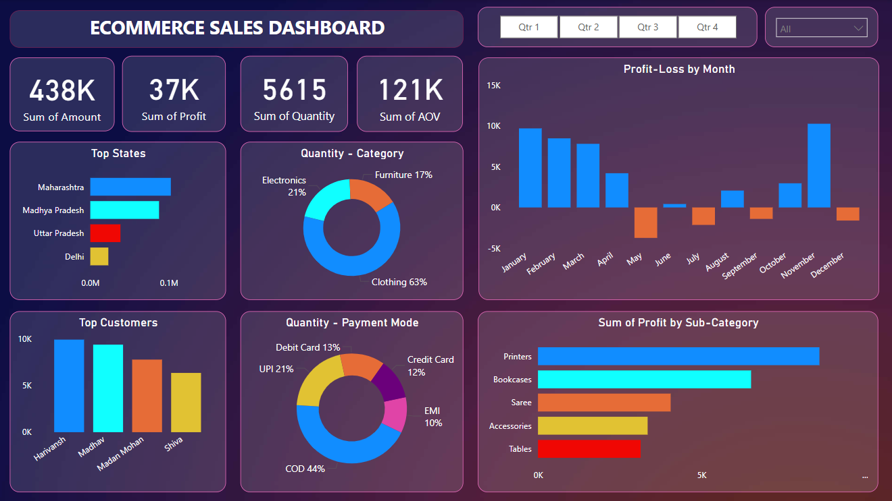
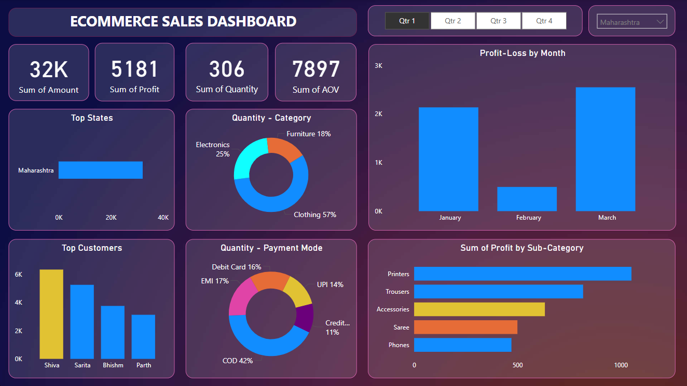
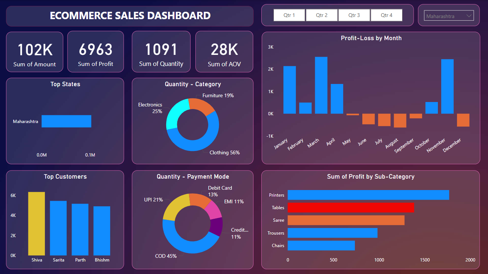

# E-commerce Sales Dashboard 

 This task was part of the **Power BI Workshop** conducted on **3 March 2025** by **Mr. Prafull Manekar Sir**, Founder of **Soham Global**.  

## 📌 Overview  
This repository contains an interactive **E-commerce Sales Dashboard** built using **Power BI**, designed to provide key insights into sales performance, customer behavior, and business trends. The dashboard allows users to visualize and analyze sales data efficiently.

## 📷 Dashboard Snapshots

## 📖 Project Learnings  
- **Created an interactive dashboard** to track and analyze online sales data.  
- **Used complex parameters** to drill down in worksheets and applied customization using filters and slicers.  
- **Established connections, joined new tables, and performed calculations** to manipulate data and enable user-driven parameters for better visualizations.  
- **Utilized various customized visualizations**, including:  
  - Bar Chart  
  - Pie Chart  
  - Donut Chart  
  - Clustered Bar Chart  
  - Scatter Chart  
  - Line Chart  
  - Area Chart  
  - Map  
  - Slicers  

## 📊 Features  
- **Sales Overview** – Track total revenue, orders, and sales trends.  
- **Sales Performance Analysis** – Check sales performance **quarterly** and **state-wise** for better decision-making.
- **Customer Insights** – Analyze customer demographics and purchasing behavior.  
- **Product Performance** – Identify top-selling products and categories.  
- **Regional Analysis** – Visualize sales distribution across different locations.  
- **Time-based Trends** – Monthly, quarterly, and yearly comparisons.  
- **KPIs & Metrics** – Profit margins, average order value, and conversion rates.  
- **Interactive Filters & Slicers** – Enable dynamic data exploration.  

## 🚀 How to Use  
1. **Download** or **Clone** the repository.  
2. Open the `.pbix` file in **Power BI Desktop**.  
3. Connect your own dataset or use the provided sample data.  
4. Customize the visuals as per your requirements.  

## 📂 Repository Contents  
- **Power BI File (.pbix)** – The main dashboard file.  
- **Sample Dataset** – Sales dataset in CSV/Excel format.  
- **Documentation** – Guide on setup and usage.  

## 📌 Requirements  
- **Power BI Desktop** (Latest Version)  
- **Sample Dataset** (CSV/Excel)  

## 📩 Connect with Me  
- **LinkedIn:** [Vansh Hedaoo](https://www.linkedin.com/in/vansh-hedaoo/)
- **Email:** [vanshhedaooprpote@gmail.com](mailto:vanshhedaooprpote@gmail.com)

Feel free to contribute, suggest improvements, or customize it for your business needs! 🚀
